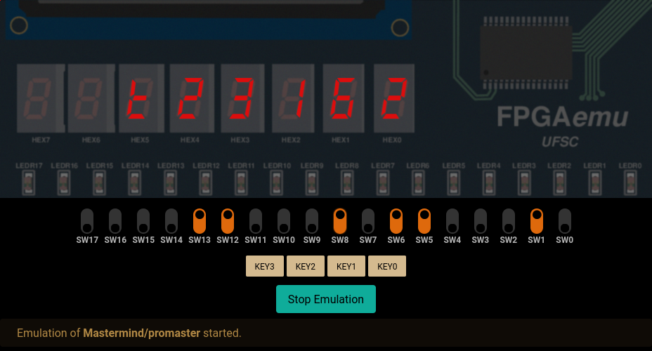

Final project from one of my CS classes.
Implements a game called Mastermind using vhdl.
You can find more information in the ```doc``` folder.




#### How to run
- Create an empty project in the [online emulator](https://fpgaemu.sites.ufsc.br/files)
- Upload all files inside the ```src/``` directory
- Set ```promaster.vhd``` as the top level
- Compile and run
